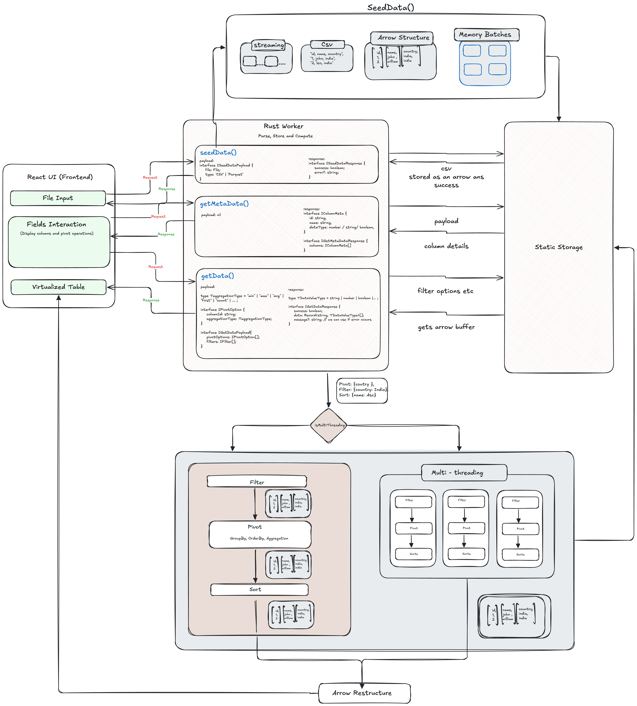

# 🦀⚛️ Blaze Engine - High-Performance Data Analytics Platform

A production-grade data analytics application leveraging Rust + WebAssembly for blazing-fast data processing in the browser. Built for handling large datasets with advanced filtering, sorting, pivoting, and aggregation capabilities.

## 🚀 [Live Demo](https://blaze-engine.vercel.app/)

[](https://vercel.com/new/clone?repository-url=https://github.com/Caleb-JV/Rust-Engine)

## ✨ Key Features

### 🚄 High-Performance Computing

- **Rust + WebAssembly**: Process millions of rows at native speeds
- **Apache Arrow**: Zero-copy data structures for memory efficiency
- **Multi-threading**: Parallel processing with Rayon
- **Streaming API**: Handle large CSV files without memory overflow

### 📊 Advanced Data Operations

- **Complex Filtering**: 11+ filter operators (equals, contains, ranges, in/not in)
- **Multi-level Sorting**: Sort by multiple columns with custom directions
- **Dynamic Pivoting**: Group by multiple dimensions with aggregations
- **Aggregations**: Sum, Average, Count, Min, Max with subtotals
- **Pagination**: Efficient limit/offset for large result sets

### 🎯 User Experience

- **Drag & Drop Interface**: Intuitive field management with react-fields-keeper
- **Real-time Processing**: Web Workers for non-blocking UI
- **Virtual Scrolling**: Smooth rendering of massive tables
- **Memory Monitoring**: Track WASM heap usage in real-time
- **Performance Metrics**: Detailed timing logs for every operation

### 🏗️ Production-Ready Architecture

- **TypeScript**: Full type safety across the stack
- **React 18**: Modern hooks and concurrent features
- **Vite**: Lightning-fast builds and HMR
- **Tailwind CSS**: Responsive, utility-first styling
- **shadcn/ui**: Beautiful, accessible component library

## 🏗️ System Architecture

```
┌──────────────────────────────────────────────────────────────┐
│                     React Frontend (TypeScript)               │
│  ┌────────────┐  ┌────────────┐  ┌────────────┐             │
│  │  Data Pane │  │ Pivot Pane │  │Filter Pane │             │
│  │  (Upload)  │  │  (D&D)     │  │ (Builder)  │             │
│  └────────────┘  └────────────┘  └────────────┘             │
│         │               │                │                    │
│         └───────────────┴────────────────┘                    │
│                         │                                     │
│                    ┌────▼─────┐                               │
│                    │  Zustand │  (State Management)           │
│                    │  Store   │                               │
│                    └────┬─────┘                               │
│                         │                                     │
│                    ┌────▼──────┐                              │
│                    │  Data     │                              │
│                    │  Service  │                              │
│                    └────┬──────┘                              │
└─────────────────────────┼─────────────────────────────────────┘
                          │ (Comlink)
┌─────────────────────────▼─────────────────────────────────────┐
│                   Web Worker (Dedicated Thread)               │
│  ┌──────────────────────────────────────────────────────────┐ │
│  │              Worker Manager                              │ │
│  │  • WASM Module Loading                                   │ │
│  │  • Request/Response Routing                              │ │
│  │  • Progress Reporting                                    │ │
│  └──────────────────────┬───────────────────────────────────┘ │
│                         │                                     │
│  ┌──────────────────────▼───────────────────────────────────┐ │
│  │           Rust Core (WebAssembly)                        │ │
│  │                                                           │ │
│  │  ┌─────────────┐  ┌──────────────┐  ┌─────────────┐    │ │
│  │  │  Streaming  │  │   Apache     │  │  Parallel   │    │ │
│  │  │  CSV Parser │  │   Arrow      │  │  Processing │    │ │
│  │  └─────────────┘  └──────────────┘  └─────────────┘    │ │
│  │                                                           │ │
│  │  ┌─────────────┐  ┌──────────────┐  ┌─────────────┐    │ │
│  │  │  Filtering  │  │   Sorting    │  │  Pivoting   │    │ │
│  │  │  Engine     │  │   Engine     │  │  Engine     │    │ │
│  │  └─────────────┘  └──────────────┘  └─────────────┘    │ │
│  │                                                           │ │
│  │  ┌───────────────────────────────────────────────────┐  │ │
│  │  │         Global State (Arrow RecordBatches)        │  │ │
│  │  └───────────────────────────────────────────────────┘  │ │
│  └──────────────────────────────────────────────────────────┘ │
└────────────────────────────────────────────────────────────────┘
```



## 🚀 Quick Start

### Prerequisites

- **Node.js** v20.19.0 or later
- **Rust** (latest stable) - [Install Rust](https://rustup.rs/)
- **wasm-pack**: `curl https://rustwasm.github.io/wasm-pack/installer/init.sh -sSf | sh`

### Installation

```bash
# Clone the repository
git clone https://github.com/pradeep-kalyan/Rust-Engine.git
cd Rust-Engine

# Install dependencies (automatically installs client deps)
npm install

# Build Rust WASM module and client
npm run build
```

### First Run

```bash
# Start both Rust and React dev servers with hot reload
npm run dev
```

The application will be available at `http://localhost:3000`

## 🛠️ Development

### Development Mode with Hot Reload

```bash
npm run dev
```

This command starts:

- 🦀 **Rust Dev Server**: Watches `rust-core/src/**/*.rs` files
    - Auto-rebuilds WASM on any Rust code change
    - Uses `fswatch` for efficient file monitoring (macOS)
    - Falls back to polling on other systems
- ⚛️ **Vite Dev Server**: React with HMR on port 3000
    - Hot module replacement for instant updates
    - Optimized for WASM module loading

### Available Scripts

| Command                | Description                                           |
| ---------------------- | ----------------------------------------------------- |
| `npm run dev`          | Start concurrent Rust + React dev servers             |
| `npm run dev:rust`     | Start Rust watcher only (rebuilds WASM on changes)    |
| `npm run dev:client`   | Start Vite dev server only                            |
| `npm run build`        | Production build (Rust → WASM + React → static files) |
| `npm run build:rust`   | Build WASM module for production (optimized)          |
| `npm run build:client` | Build React app for production                        |
| `npm run clean`        | Remove all build artifacts and node_modules           |
| `npm run prettier`     | Format code with Prettier                             |

### Development Tips

**Watch WASM rebuilds:**

```bash
# Terminal 1: Watch Rust changes
npm run dev:rust

# Terminal 2: Start React dev server
npm run dev:client
```

**Manual WASM rebuild:**

```bash
cd rust-core
./build.sh  # Production build
# OR
./dev.sh    # Development build with watching
```

## 📁 Project Structure

```
Rust-Engine/
├── 🦀 rust-core/                      # Rust WebAssembly Core
│   ├── src/
│   │   ├── lib.rs                     # Main WASM exports & streaming API
│   │   ├── api.rs                     # Async WASM API layer
│   │   ├── storage.rs                 # Global state management (Arrow batches)
│   │   ├── types/
│   │   │   ├── mod.rs
│   │   │   └── query_types.rs         # Query, Filter, Sort, Pivot types
│   │   ├── filters.rs                 # Advanced filtering engine (11+ operators)
│   │   ├── sorting.rs                 # Multi-column sorting
│   │   ├── pivot/
│   │   │   ├── mod.rs
│   │   │   ├── grouping.rs            # Group-by logic
│   │   │   └── aggregation.rs         # Sum, Avg, Count, Min, Max
│   │   ├── operations.rs              # Aggregation implementations
│   │   ├── parallel.rs                # Multi-threading with Rayon
│   │   ├── dataHelpers/
│   │   │   ├── mod.rs
│   │   │   └── helpers.rs             # Arrow data utilities
│   │   └── utils/
│   │       ├── mod.rs
│   │       ├── error.rs               # Error handling
│   │       ├── timing.rs              # Performance measurement
│   │       └── data_generator.rs      # Sample data generation
│   ├── Cargo.toml                     # Rust dependencies (Arrow, Rayon)
│   ├── build.sh                       # Production WASM build script
│   ├── dev.sh                         # Development with hot reload
│   └── API_DOCUMENTATION.md           # Comprehensive Rust API docs
│
├── ⚛️ client/                         # React TypeScript Frontend
│   ├── src/
│   │   ├── App.tsx                    # Main application component
│   │   ├── main.tsx                   # React entry point
│   │   ├── features/
│   │   │   ├── DataProvider.tsx       # FieldsKeeper context provider
│   │   │   ├── MainHeader.tsx         # Header with metrics & controls
│   │   │   ├── DataPane.tsx           # Data upload & field list
│   │   │   ├── PivotPane.tsx          # Drag & drop pivot builder
│   │   │   ├── FilterPane.tsx         # Advanced filter builder
│   │   │   └── TableView.tsx          # Virtual scrolling table
│   │   ├── components/
│   │   │   ├── DataInput.tsx          # CSV upload component
│   │   │   ├── FilterComponent.tsx    # Individual filter UI
│   │   │   ├── SortBuilder.tsx        # Sort configuration UI
│   │   │   ├── ProcessingIndicator.tsx # Loading spinner
│   │   │   └── ui/                    # shadcn/ui components
│   │   ├── services/
│   │   │   └── dataService.ts         # Business logic & WASM bridge
│   │   ├── store/
│   │   │   └── fieldsStore.ts         # Zustand state management
│   │   ├── worker/
│   │   │   ├── WorkerClient.ts        # Comlink worker interface
│   │   │   ├── WorkerManagers.ts      # Worker lifecycle management
│   │   │   └── types.ts               # Worker message types
│   │   ├── wasm/
│   │   │   ├── index.ts               # WASM module loader
│   │   │   └── package/               # Generated WASM bindings
│   │   │       ├── rust_core.js       # JS glue code
│   │   │       ├── rust_core_bg.wasm  # WASM binary
│   │   │       └── rust_core.d.ts     # TypeScript definitions
│   │   ├── types/
│   │   │   ├── index.ts               # Shared types
│   │   │   └── metadata.ts            # Schema metadata types
│   │   ├── lib/
│   │   │   ├── utils.ts               # General utilities
│   │   │   ├── data.utils.ts          # Data processing helpers
│   │   │   └── common.constants.ts    # App constants
│   │   └── utils/
│   │       └── pivotHelpers.ts        # Pivot calculation utilities
│   ├── public/                        # Static assets
│   ├── package.json                   # Frontend dependencies
│   ├── vite.config.ts                 # Vite configuration
│   ├── tsconfig.json                  # TypeScript configuration
│   ├── components.json                # shadcn/ui config
│   └── index.html                     # HTML entry point
│
├── 📋 package.json                    # Root workspace configuration
├── 🚀 vercel.json                     # Vercel deployment config
├── 📄 LICENSE                         # MIT License
└── 📖 README.md                       # This file
```

## 📊 Core Capabilities

### Data Import

- **CSV Upload**: Drag & drop or file picker
- **Streaming Parser**: Handle multi-GB files without memory issues
- **Automatic Type Inference**: Int8/16/32/64, Float32/64, Boolean, String, Dates
- **Chunk Processing**: Incremental loading with progress tracking

### Filtering System

Supports 11 advanced operators:

- **Comparison**: `equals`, `notequals`, `greaterthan`, `lessthan`, `greaterthanorequal`, `lessthanorequal`
- **String**: `contains`, `notcontains`
- **Set**: `in`, `notin` (array values)
- **Range**: `between` (min/max numeric range)

### Sorting Engine

- **Multi-column**: Sort by unlimited columns
- **Bi-directional**: Ascending or descending per column
- **Type-aware**: Proper sorting for numbers, strings, dates

### Pivot & Aggregation

- **Group By**: Multiple row dimensions
- **Aggregations**: Sum, Average, Count, Min, Max
- **Subtotals**: Optional subtotal rows per group
- **Mixed Aggregations**: Different functions per value column

### Performance Optimizations

- **Zero-Copy**: Arrow columnar format minimizes memory allocations
- **Vectorized Operations**: SIMD-capable operations where possible
- **Parallel Execution**: Multi-threaded aggregations with Rayon
- **Efficient Serialization**: Minimal data transfer between WASM/JS

## 🔧 Environment Setup

### macOS Users: Rust Compilation Fix

If you encounter `ld: library 'System' not found` errors:

```bash
# Add to your shell profile (~/.zshrc or ~/.bash_profile)
export LIBRARY_PATH="$(xcrun --show-sdk-path)/usr/lib:$LIBRARY_PATH"

# Reload shell configuration
source ~/.zshrc  # or source ~/.bash_profile
```

This is automatically handled by `rust-core/dev.sh` during development.

### Verify Installation

```bash
# Check Rust toolchain
rustc --version
# Expected: rustc 1.70+

wasm-pack --version
# Expected: wasm-pack 0.12+

# Check Node.js
node --version
# Expected: v20.19.0+

npm --version
# Expected: 10.0.0+

# Test Rust compilation
cd rust-core
cargo check
# Should complete without errors

# Test WASM build
cd rust-core
./build.sh
# Should generate files in client/src/wasm/package/
```

## 🚀 Deployment

### Vercel (Recommended)

**One-Click Deploy:**
[](https://vercel.com/new/clone?repository-url=https://github.com/pradeep-kalyan/Rust-Engine)

**Manual Deploy:**

```bash
# Install Vercel CLI
npm i -g vercel

# Deploy
vercel --prod
```

**Configuration:**

- `vercel.json` is pre-configured
- Build command: `cd client && npm run build`
- Output directory: `client/dist`
- Framework: None (SPA)

### Netlify

```bash
# Build for production
npm run build

# Deploy client/dist/ directory
netlify deploy --prod --dir=client/dist
```

### Docker (Self-hosted)

```dockerfile
FROM node:20-alpine AS build
WORKDIR /app
COPY package*.json ./
RUN npm install
COPY . .
RUN npm run build

FROM nginx:alpine
COPY --from=build /app/client/dist /usr/share/nginx/html
COPY nginx.conf /etc/nginx/conf.d/default.conf
EXPOSE 80
CMD ["nginx", "-g", "daemon off;"]
```

### Static Hosting (AWS S3, Azure Blob, etc.)

```bash
npm run build
# Upload client/dist/ contents to your static hosting bucket
# Configure for SPA routing (all paths → index.html)
```

## 🎯 Usage Guide

### 1. Upload Data

- Click "Upload CSV" or drag & drop a CSV file
- Large files are streamed in chunks with progress indication
- Schema is automatically detected and displayed

### 2. Build Pivot Tables

- **Data Pane**: Lists all available fields from your CSV
- **Rows Bucket**: Drag fields to group by (e.g., Category, Region)
- **Values Bucket**: Drag fields to aggregate (e.g., Sales, Quantity)
- Select aggregation type: Sum, Average, Count, Min, Max
- Toggle subtotals for hierarchical grouping

### 3. Apply Filters

- Click "Add Filter" in the Filter Pane
- Select column, operator, and value
- Combine multiple filters (AND logic)
- Filters apply dynamically to pivot results

### 4. Sort Results

- Add sort rules in Sort Pane
- Multi-column sorting supported
- Choose ascending or descending per column

### 5. Analyze Results

- **Table View**: Virtualized scrolling for millions of rows
- **Header Metrics**:
    - Row/column count
    - Memory usage (WASM heap)
    - Processing time (Rust execution)
    - Estimated JS time (for comparison)
- **Export**: Copy data or download results (future feature)

### Example Workflow

```
1. Upload "sales_data.csv" (1M rows, 15 columns)
   ✓ Parsed in 2.3s, 45MB memory

2. Create Pivot:
   Rows: [Region, Category]
   Values: [Revenue (Sum), Units (Count)]
   ✓ Grouped 1M rows → 156 groups in 0.8s

3. Add Filter:
   Revenue > 10000 AND Region in ['North', 'South']
   ✓ Filtered to 87 rows in 0.1s

4. Sort:
   Revenue (desc), Units (desc)
   ✓ Sorted in 0.02s

Result: 87 rows, 4 columns, 0.92s total time
```

## 🛠️ Technology Stack

### Rust Core

- **Arrow** 57.0.0 - Columnar data format
- **Rayon** 1.10 - Data parallelism
- **wasm-bindgen** 0.2 - JS/WASM interop
- **serde** 1.0 - Serialization

### React Frontend

- **React** 18.3 - UI framework
- **TypeScript** 5.9 - Type safety
- **Vite** 7.1 - Build tool
- **Zustand** 5.0 - State management
- **Tailwind CSS** 4.1 - Styling
- **shadcn/ui** - Component library
- **react-fields-keeper** 4.13 - Drag & drop fields
- **@tanstack/react-virtual** 3.13 - Virtual scrolling
- **apache-arrow** 21.1 - Arrow JS library
- **Comlink** 4.4 - Web Worker RPC

## 🧪 Testing

### Run Tests

```bash
# Rust unit tests
cd rust-core
cargo test

# Rust integration tests
cargo test --test '*'

# Frontend tests (if configured)
cd client
npm test
```

### Manual Testing

```bash
# Generate sample data
cd rust-core
cargo run --example generate_data

# Test with large dataset
# Use the generated CSV in the app
```

## 📈 Performance Benchmarks

Tested on MacBook Pro M1, 16GB RAM:

| Operation               | Dataset Size        | Rust Time | JS Estimated | Speedup |
| ----------------------- | ------------------- | --------- | ------------ | ------- |
| CSV Parse               | 1M rows, 50MB       | 2.3s      | ~8-10s       | 3-4x    |
| Pivot (2 dims)          | 1M rows → 1K groups | 0.8s      | ~5-7s        | 6-8x    |
| Filter (complex)        | 1M rows             | 0.1s      | ~0.5-1s      | 5-10x   |
| Sort (2 cols)           | 100K rows           | 0.02s     | ~0.1-0.2s    | 5-10x   |
| Aggregation (5 metrics) | 1M rows, 100 groups | 0.3s      | ~2-3s        | 6-10x   |

_JS times are estimates based on typical JS implementations. Actual performance varies by browser and hardware._

## 🐛 Troubleshooting

### WASM build fails

```bash
# Ensure wasm-pack is installed
cargo install wasm-pack

# Check Rust targets
rustup target add wasm32-unknown-unknown

# Rebuild
cd rust-core
./build.sh
```

### Memory errors in browser

- Large datasets may exceed WASM memory limits
- Try increasing WASM memory in `rust-core/src/lib.rs`
- Use streaming API for files > 500MB

### Worker not loading

- Check browser console for CORS errors
- Ensure Vite dev server is running with correct headers
- Verify WASM file is accessible at `/src/wasm/package/rust_core_bg.wasm`

### Hot reload not working

- Restart both dev servers: `npm run dev`
- Clear Vite cache: `rm -rf client/node_modules/.vite`
- Rebuild WASM: `cd rust-core && ./build.sh`

## 🤝 Contributing

We welcome contributions! Please follow these guidelines:

1. **Fork** the repository
2. **Create** a feature branch: `git checkout -b feature/amazing-feature`
3. **Make** your changes with clear commit messages
4. **Test** thoroughly (Rust tests + manual testing)
5. **Format** code:
    ```bash
    cargo fmt  # Rust
    npm run prettier  # TypeScript
    ```
6. **Commit**: `git commit -m 'feat: Add amazing feature'`
7. **Push**: `git push origin feature/amazing-feature`
8. **Open** a Pull Request with description

### Contribution Ideas

- [ ] Add more aggregation functions (median, mode, variance)
- [ ] Implement data export (CSV, JSON, Parquet)
- [ ] Add charting/visualization
- [ ] Support for JOIN operations
- [ ] Window functions (running totals, ranks)
- [ ] Custom column calculations
- [ ] Save/load query configurations
- [ ] Dark mode improvements
- [ ] Mobile-responsive design enhancements

## 📝 License

MIT License - see [LICENSE](LICENSE) file for details.

Copyright (c) 2025 Rust + WebAssembly + React Hackathon Boilerplate

## 🔗 Links & Resources

- **Live Demo**: [blaze-engine.vercel.app](https://blaze-engine.vercel.app/)
- **Repository**: [github.com/Caleb-JV/Rust-Engine)](https://github.com/Caleb-JV/Rust-Engine)
- **API Documentation**: [rust-core/API_DOCUMENTATION.md](rust-core/API_DOCUMENTATION.md)

### Learn More

- [Rust WebAssembly Book](https://rustwasm.github.io/book/)
- [Apache Arrow Documentation](https://arrow.apache.org/docs/)
- [wasm-bindgen Guide](https://rustwasm.github.io/wasm-bindgen/)
- [React + WASM Integration](https://developer.mozilla.org/en-US/docs/WebAssembly)

## 🙏 Acknowledgments

- **Apache Arrow** team for the excellent columnar format
- **Rust WASM** working group for amazing tooling
- **shadcn/ui** for beautiful components
- **Vercel** for seamless deployment
- All open-source contributors

---

**Built with ❤️ for developers who demand performance without compromise!** 🚀⚡

_Questions? Open an issue or reach out to the maintainers!_
